Overview
========

The following will present different tools and use cases to perform groundtracks of space/aerial assets, determine orbital elements from position/velocity and vice versa,
perform spacecraft/aircraft visibility check when object is tracked from a ground station, size link budgets for communication purposes, and so forth.

# Coordinates Frames, Orbital Elements, Position and Velocity Determination

The ECI coordinates frame is described Fig. 1. 

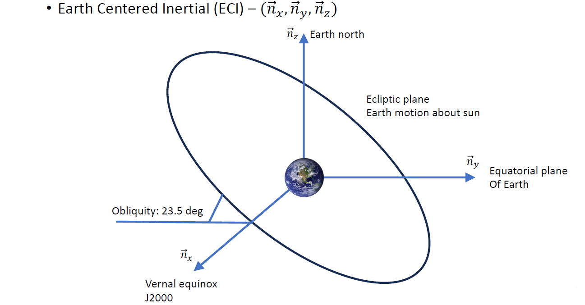
Fig 1. ECI coordinates frame

A satellite's orbite, around the Earth for instance, is described by 6 orbital elements that qualify in an unambiguous way its orbit, as shown Fig. 2. 

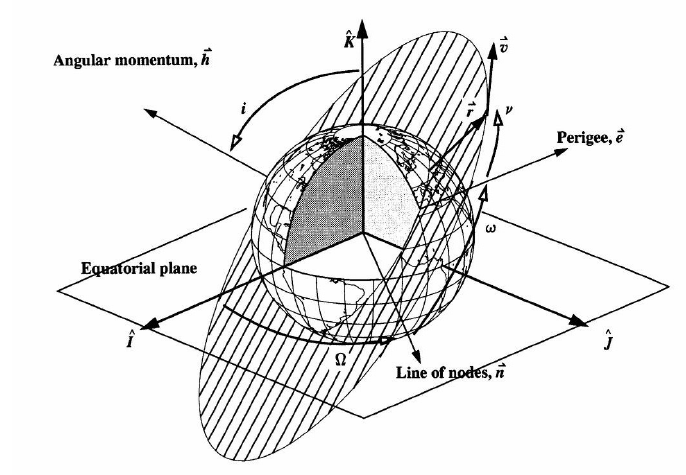

Fig 2. Orbital elements describing satellites orbits

Position and velocity vectors in ECI of the satellite are related to its orbital elements via equations derived from orbital mechanics. Often, the true anomaly
$\theta$ is not known, but the time $t$ after crossing perigee at which we want to know the spacecraft position and velocity vectors is.
For instance, a satellite Sat-1 orbiting the Earth with a position vector specified by 𝒓 = 6045𝒊 + 3490𝒋 + 0𝒌 𝑘𝑚 and a velocity vector specified 
by 𝒗 = −2.457𝒊 + 6.618𝒋 + 2.533𝒌 𝑘𝑚/𝑠 in ECI coordinates frame would have the following orbital elements Fig. 3 (cf code [ECI.m](https://github.com/Antoine-Marin-Git/Trajectory_determination_and_Objet_tracking/tree/master/ECI.m)):

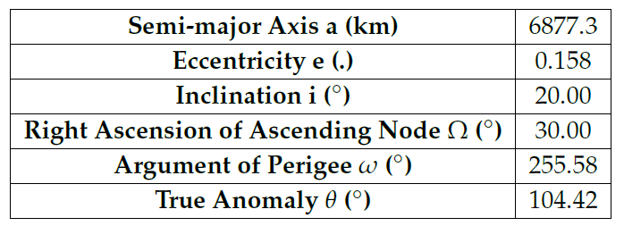

Fig 3. Orbital elements derived from Sat-1 position and velocity vectors 

Conversely, the code [Reverse_ECI.m](https://github.com/Antoine-Marin-Git/Trajectory_determination_and_Objet_tracking/tree/master/Reverse_ECI.m) gives the position and velocity vectors starting from given orbital elements. For instance, for the ISS being at $t = 100$ s after perigee, $a = 6.796620707 × 10^6$ 𝑚, $𝑖 = 51.6439°$, $𝑒 = 2.404 × 10^{−4}$, $\Omega = 86.8571°$, $\omega = 1.8404°$, the resulting position vector is 𝒓 = 6775.8⃗𝒊 + 381.3⃗𝒋 + 2054.4⃗𝒌 𝑘𝑚. This code needs to solve the Kepler equation, implemented in [Kepler_Solver.m](https://github.com/Antoine-Marin-Git/Trajectory_determination_and_Objet_tracking/tree/master/Kepler_Solver.m), using the Newton-Raphson method, implemented in [NewtRaph.m](https://github.com/Antoine-Marin-Git/Trajectory_determination_and_Objet_tracking/tree/master/NewtRaph.m)

# Object Tracking and Trajectory Visualization

The previous tools and transformations are a fundamental basis to develop more advanced tool to enable aerial/spatial assets tracking and trajectory visualization. 
Groundtracks especially are of interest, as it is a projection of the spacecraft orbit on the spinning Earth in terms of longitude and latitude, or even altitude aswell if one wants to visualize it in 3D (equivalent to using ECEF coordinates frame, shown Fig. 4)

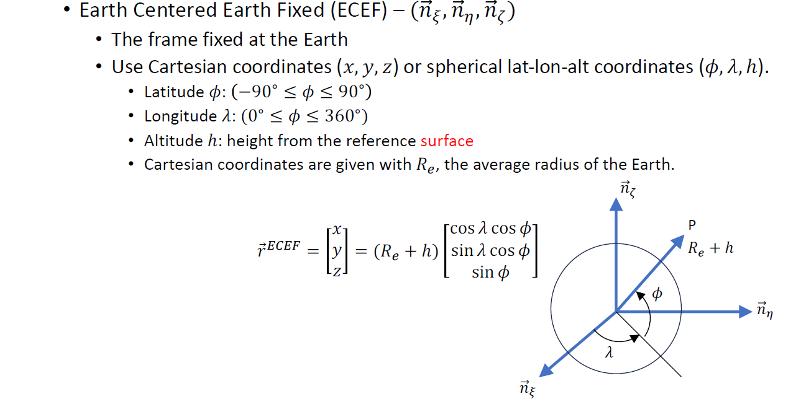

Fig 4. ECEF coordinates frame

Once the orbital elements of a satellite orbit are known, the code [ECI_2_ECEF.m](https://github.com/Antoine-Marin-Git/Trajectory_determination_and_Objet_tracking/tree/master/ECI_2_ECEF.m) is used to switch from the ECI frame to the ECEF frame at any given time $t$, using the Kepler equation mentioned before and appropriate transformations based on rotation matrices implemented in [Rotation.m](https://github.com/Antoine-Marin-Git/Trajectory_determination_and_Objet_tracking/tree/master/Rotation.m). To know the satellite trajectory over time, one has to store the satellite coordinates in ECEF for a desired duration, and plot it on either a planisphere or a 3D representation of Earth. The code [GroundTrack.m](https://github.com/Antoine-Marin-Git/Trajectory_determination_and_Objet_tracking/tree/master/GroundTrack.m) is used to visualize the satellite ground track on a planisphere (use [Blue_Marble_2002.png](https://github.com/Antoine-Marin-Git/Trajectory_determination_and_Objet_tracking/tree/master/Graphics/Blue_Marble_2002.png)), and the code [Plot3D_Earth.m](https://github.com/Antoine-Marin-Git/Trajectory_determination_and_Objet_tracking/tree/master/Plot3D_Earth.m) is used to visualize the satellite ground track on a 3D representation of the Earth (use [1024px-Land_ocean_ice_2048.jpg](https://github.com/Antoine-Marin-Git/Trajectory_determination_and_Objet_tracking/tree/master/Graphics/1024px-Land_ocean_ice_2048.jpg))

We can use the ISS as a case study (cf [Use_Case_ISS.m](https://github.com/Antoine-Marin-Git/Trajectory_determination_and_Objet_tracking/tree/master/Use_Case_ISS.m)):

Using a recording duration of 30000s (1s step) and the following TLE of the 06/05/2024 at 13:08:21, 
```
a_ISS = 6.796620707e6; % m
e_ISS = 0.0006059; % (.)
t_ISS = 30000; % s
i_ISS = 51.6439; % deg
Omega_ISS = 11.3423; % deg
omega_ISS = 278.6277; % deg
```
the ground track in 2D and 3D can be visualized Fig 5.a) and 5.b). Here is added too the ground track in ECI for the orbit visualization Fig 5.c). The start point is highlighted in green while the end point is highlighted in orange.

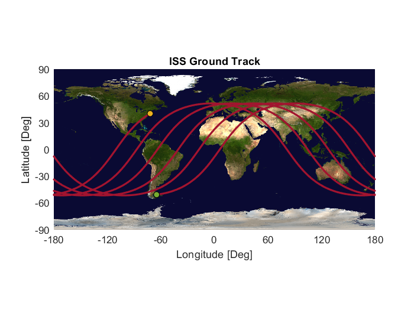

Fig 5.a) ISS Ground Track

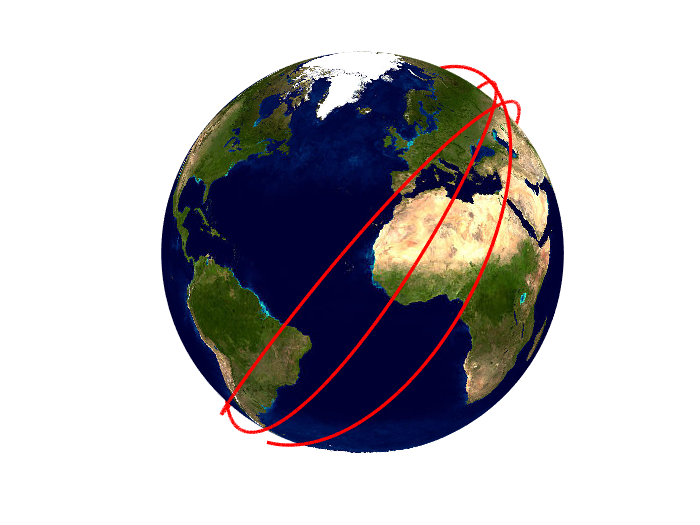

Fig 5.b) ISS 3D Ground Track

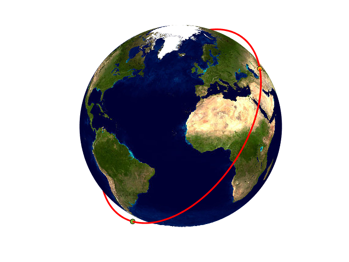

Fig 5.c) ISS Orbit Visualization

Spacecraft/Aircraft are monitored by ground stations that can only communicate with the moving object during a fraction of the orbit or of the trajectory, when it is in the station's line of sight. The ECEF or ECI coordinates of the spacecraft/aircraft need to be translated into a coordinates frame that is suitable for the observation from the ground station. Such a frame is the Topocentric coordinates frame, referenced as TOPO in this project, and is defined in Fig. 6.a) and 6.b) where the origin is chosen to be the ground station. The tracked object is characterized by its azimuth $\alpha$ and elevation $\epsilon$.

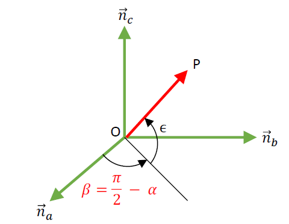

Fig. 6.a) 

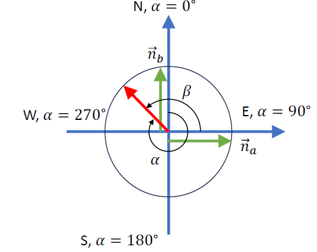

Fig 6.b) 

The line of sight from the ground station to the satellite is then derived as

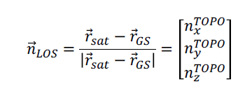

Where the code used to translate the coordinates from ECEF to TOPO and derive the line of sight is [GSVisibilityCheck.m](https://github.com/Antoine-Marin-Git/Trajectory_determination_and_Objet_tracking/tree/master/GSVisibilityCheck.m) using the appropriate rotation matrix shown Fig. 7

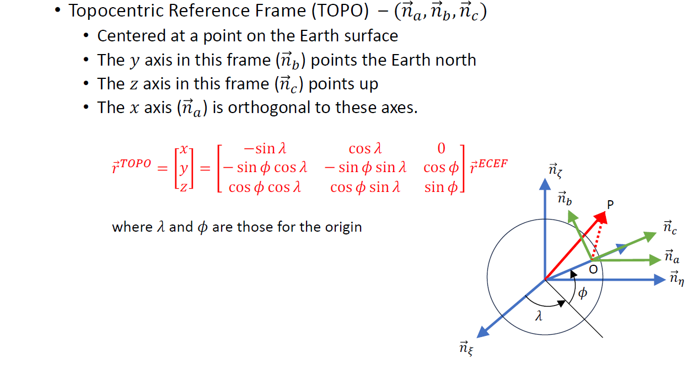

Azimuth $\alpha$ and elevation $\epsilon$ are derived from TOPO coordinates using the following equations:

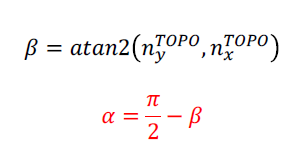
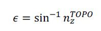

To know the segment of the orbit where the asset is observable, and when it is therefore possible do downlink/uplink data, the idea is quite simple. An array ```Gamma``` is created that stores for each time step the time, and the three coordinates in ECEF (latitiude, longitude, and altitude). Given the station's line of sight and additional conditions (for instance the ground station can communicate with the moving object only if it is above 20$^\circ$ of elevation above the horizon), a subset of ```Gamma```, ```gamma```, is created that stores only the time and coordinates for which these conditions are satisfied.


